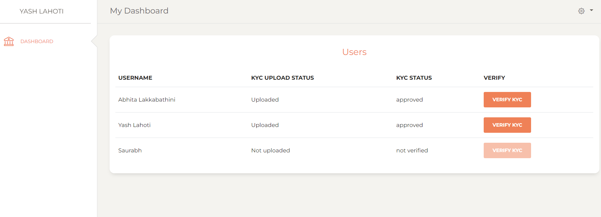

# LendingCircles
A P2P lending app that provides a platform for users in a group to loan a particular amount of money from friends based on their validated credit scores. The users providing the amount can select the percentage of total amount they'll be contributing. Based on the mortgages lender will lend the money to borrower. Once the tenure is completed, borrower can return the money to lender and clear the mortgage.

