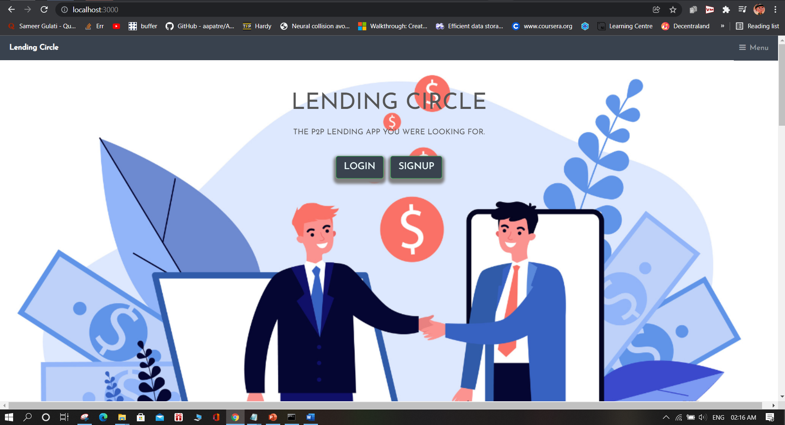
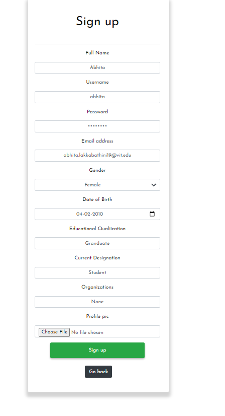
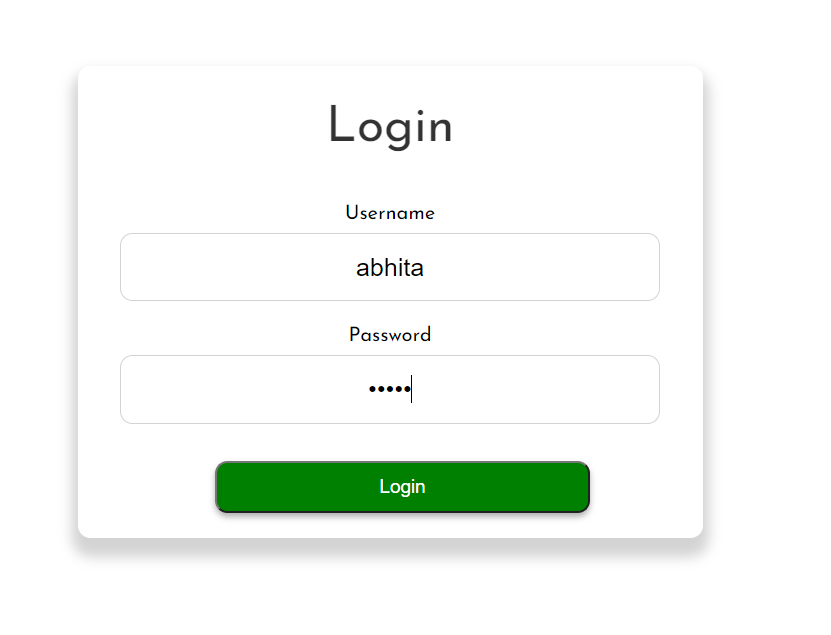
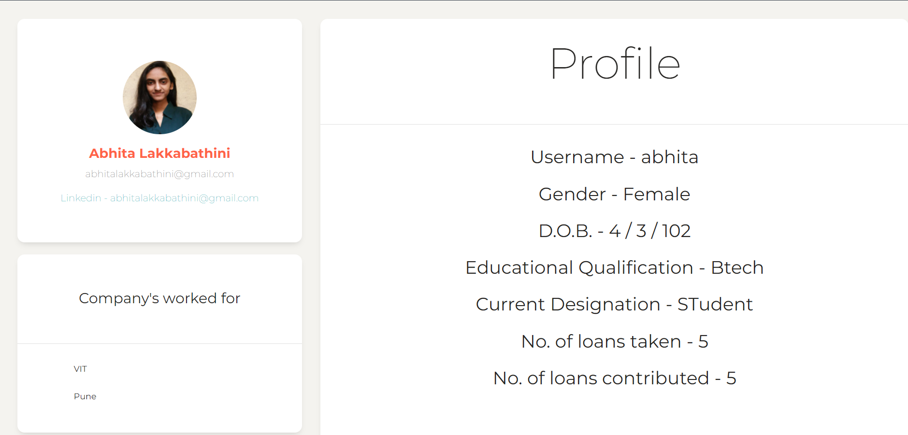
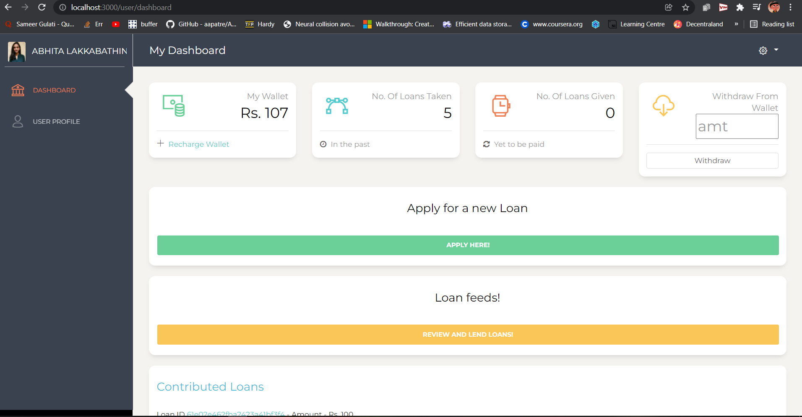

# LendingCircles
A Node.Js based P2P lending app that provides a platform for users in a group to loan a particular amount of money from friends based on their validated credit scores. The users providing the amount can select the percentage of total amount they'll be contributing towards

